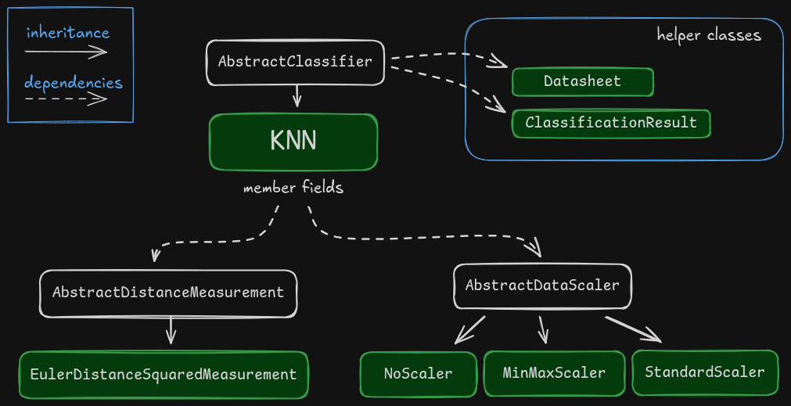

# KNN-classifier

c++ library for classification problem, implementing KNN classifier.

Read about KNN classifier here: [LINK](https://www.geeksforgeeks.org/machine-learning/k-nearest-neighbours/).


## Project structure 

All code is written heavily using OOP principles. It utilizes abstract base classes to make adding new classifiers or KNN components straightforward. 

Class structure diagram:



## Compile and run

Compile everything:

```sh
make
```

Above will create an executable located in: `build/KNN-classifier`

Run the program:

```sh
make run
```

To clean the build:

```sh
make clean
```

## Running unit tests

requires [gtest](https://google.github.io/googletest/) library

**Fedora installation:**
```sh
sudo dnf install gtest-devel
```

**Run tests**
```sh
make test
```
